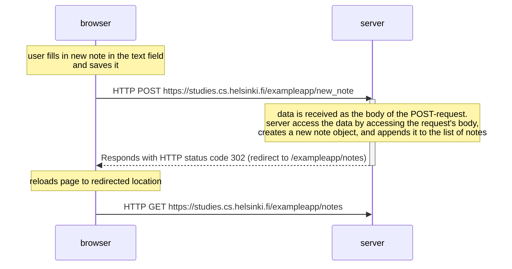

```mermaid
sequenceDiagram
    participant browser
    participant server

    Note over browser: user fills in new note in the text field<br/>and saves it

    browser->>server: HTTP POST https://studies.cs.helsinki.fi/exampleapp/new_note
    activate server

    Note over server: data is received as the body of the POST-request.<br/>server access the data by accessing the request's body,<br/>creates a new note object, and appends it to the list of notes

    server-->>browser: Responds with HTTP status code 302 (redirect to /exampleapp/notes)
    deactivate server

    Note over browser: reloads page to redirected location

    browser->>server: HTTP GET https://studies.cs.helsinki.fi/exampleapp/notes
```