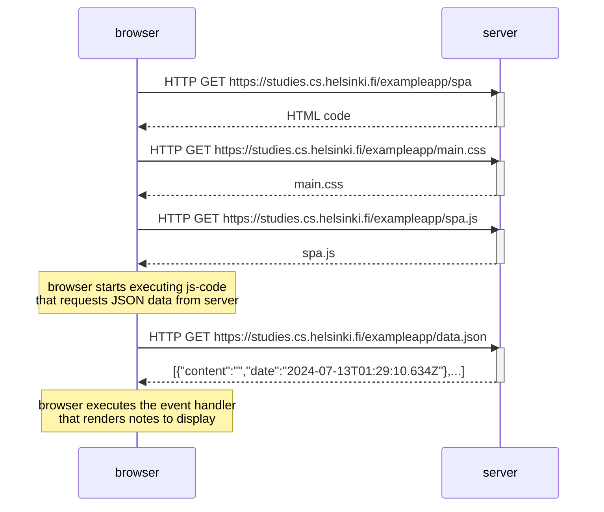

```mermaid
sequenceDiagram
    participant browser
    participant server
    
    browser->>server:HTTP GET https://studies.cs.helsinki.fi/exampleapp/spa
    activate server
    server-->>browser:HTML code
    deactivate server

    browser->>server:HTTP GET https://studies.cs.helsinki.fi/exampleapp/main.css
    activate server
    server-->>browser:main.css
    deactivate server

    browser->>server:HTTP GET https://studies.cs.helsinki.fi/exampleapp/spa.js
    activate server
    server-->>browser:spa.js
    deactivate server

    Note over browser: browser starts executing js-code<br/>that requests JSON data from server

    browser->>server:HTTP GET https://studies.cs.helsinki.fi/exampleapp/data.json
    activate server
    server-->>browser:[{"content":"","date":"2024-07-13T01:29:10.634Z"},...]
    deactivate server

    Note over browser: browser executes the event handler<br/>that renders notes to display
```