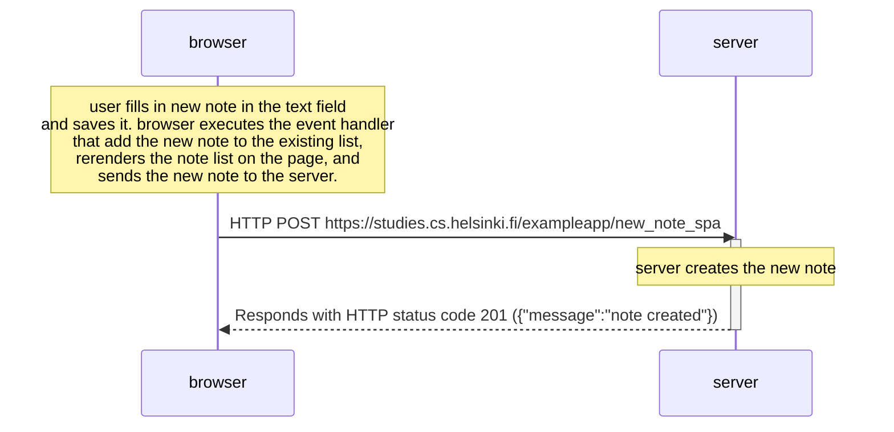

```mermaid
sequenceDiagram
    participant browser
    participant server

    Note over browser:user fills in new note in the text field <br/>and saves it. browser executes the event handler<br/>that add the new note to the existing list, <br/>rerenders the note list on the page, and <br/>sends the new note to the server.

    browser->>server: HTTP POST https://studies.cs.helsinki.fi/exampleapp/new_note_spa
    activate server

    Note over server: server creates the new note

    server-->>browser: Responds with HTTP status code 201 ({"message":"note created"})
    deactivate server
```